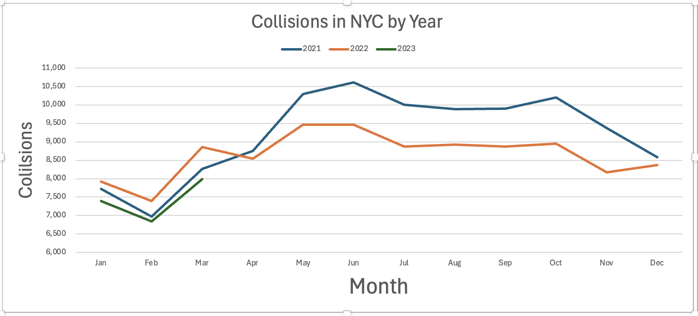
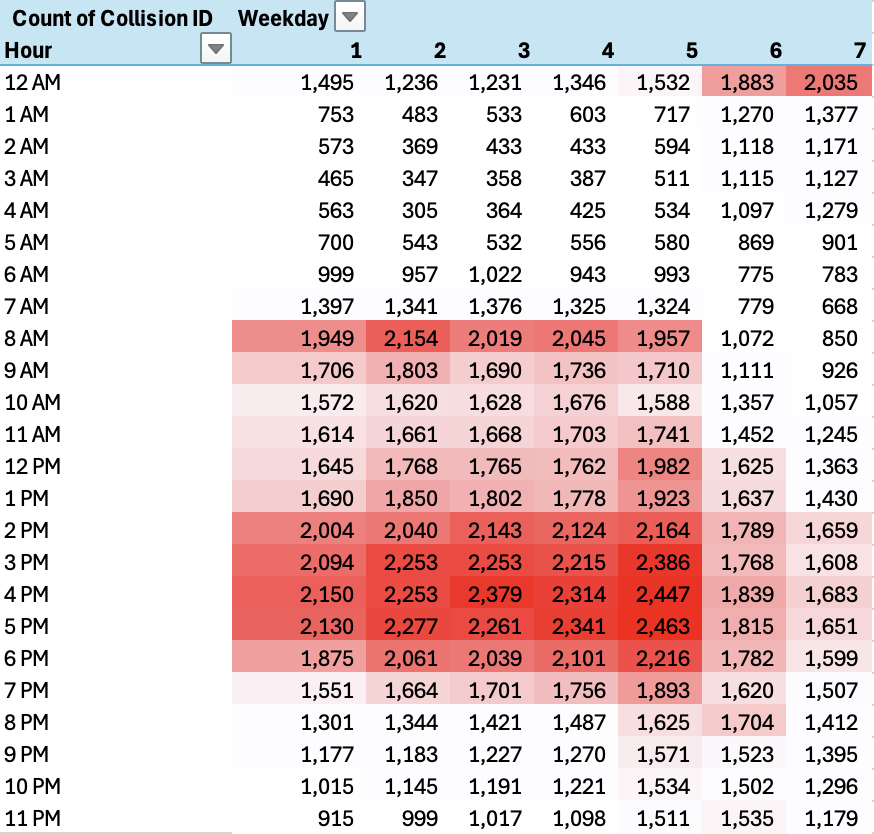
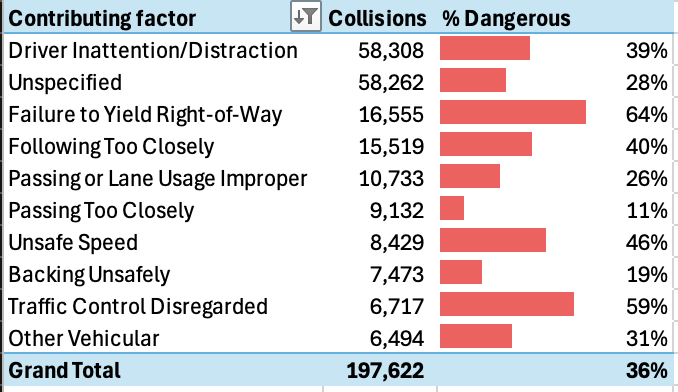

# **NYC Collision Analysis Report**

## **1. Project Overview**

**Objective:** This project analyzes NYC collision data to identify seasonal patterns, high-risk times, and contributing factors to vehicular accidents. The insights derived from this analysis aim to inform road safety improvements and policy recommendations.  
**Dataset:** NYC collision dataset containing information on date, time, location, and collision details.  
**Tools Used:** Microsoft Excel (Pivot Tables, Power Query, Conditional Formatting, WEEKDAY Function, HOUR Function, Custom Calculated Columns)  

## **2. Data Preparation & Methodology**

### **2.1 Data Cleaning & Transformation**

- The `WEEKDAY` function was used to extract the weekday from the date column for time-based analysis.
- The `HOUR` function was applied to categorize collisions by the hour of the day.
- A `Ones` column was created to compute percentages, enabling visual representation of dangerous factors.

### **2.2 Analytical Approach**

1. **Time-Based Collision Trends:** 
   - Utilized Pivot Tables to compare collisions across multiple years and identify peak months.
   - Implemented line charts to visualize trends across months.
2. **Collision Heatmap Analysis:** 
   - Created a heatmap using conditional formatting to highlight peak accident hours.
   - Mapped high-risk periods based on weekdays and hours of the day.
3. **Contributing Factors & Risk Assessment:**
   - Analyzed primary causes of accidents using pivot tables.
   - Utilized percentage calculations and data bars to represent contributing factors.

## **3. Key Findings & Visualizations**

### **3.1 Seasonal Collision Patterns**

 Monthly trends were analyzed to determine the variations in collision frequency across 2021, 2022, and 2023.

- Notable increases were observed in warmer months, particularly between **February and June**.
- **April 2022** saw a reduction of collisions, something to keep an eye on for future trend analysis.
- **Downward trends** from June through December with a slight uptick in collisions for October.
**Visualization:**
  

### **3.2 Collision Density Heatmap**

- Collisions are most frequent during **rush hours (2 PM - 6 PM)** on weekdays.
- Late-night and early-morning hours (12 AM - 6 AM) exhibited lower collision counts.
- Weekends between 12AM and 1AM have **elevated collision** numbers.
**Visualization:**
  

### **3.3 Contributing Factors Analysis**

- **Top 3 Causes of Collisions:**
  - Driver Inattention/Distraction
  - Unspecified
  - Failure to Yield Right-of-Way
- More than **60% of "Failure to Yield Right-of-Way" collisions** caused an injury or death.
- Almost 30% of top contributing factors are "Unspecified".
**Visualization:**
  

## **4. Recommendations & Future Enhancements**

### **4.1 Recommendations for NYC Road Safety**

- Increase public awareness regarding high-risk hours and accident-prone intersections.
- Implement additional speed control measures, especially during peak collision times.
- Enhance traffic enforcement and monitoring in high-risk zones.
- Reduce the number of unspecified accidents to create more accurate future analysis.

### **4.2 Future Enhancements**

- **Visualization:** Developing an interactive dashboard using **Power BI or Tableau**.

## **5. Project Files**

- 🔗 **[Download Full Excel Report](Analysis.xlsx)**